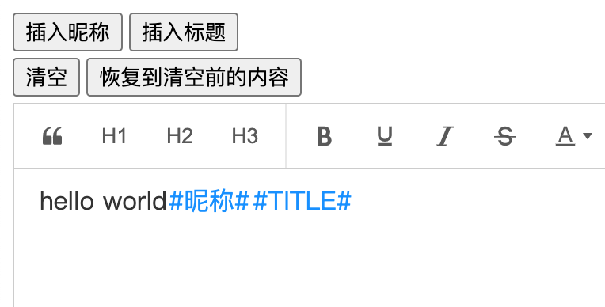

# Editor based on [wangEditor 5](https://github.com/wangeditor-team/wangEditor)

基本用法请参考：https://www.wangeditor.com/

## 介绍

Try out the [demo](https://kobememory.github.io/km-wangeditor/)!



### 新增Placeholder(占位符)模块

```html
<div id="editor"></div>
```

```typescript
// 占位符集合
// value: 必填项，editor.getText最终得到的内容
// alias: 可选项，当alias和value同时存在时，编辑器中会显示alias，通过editor.getText会得到value
const placeholderList: IEditorConfig['placeholderList'] = [
  { value: "#NICKNAME#", alias: "#昵称#" },
  { value: "#TITLE#" },
];
const editor = createEditor({
  selector: document.getElementById('editor'),
  config: {
    placeholderList: placeholderList,
  },
});
```


新增编辑器 API:
##### insertPlaceholder - 在选区插入占位符:

```ts
// 在编辑器中插入alias, 如果alias为空则插入value
// editor.getText() => value
function insertPlaceholder(value: string, alias?: string): void

editor.insertPlaceholder('#NAME#') // 在编辑器中插入 '#NAME#'
editor.getText() // #NAME#

editor.insertPlaceholder('#NAME#', '#姓名#') // 在编辑器中插入 '#姓名#'
editor.getText() // #NAME#
```

##### setText - 重置编辑器的内容:

```ts
editor.setText('#NICKNAME# 你好 #TITLE#')
editor.getText() // '#昵称# 你好 #TITLE#'
```

定义 CSS 样式，可参考

```less
.w-e-text-container [data-slate-editor] {
  .w-e-placeholder-container {
    user-select: none;
    color: #1890ff;
    margin: 0 1px;
    border-radius: 2px;
    box-shadow: none;

    &--selected {
      border: 2px solid var(--w-e-textarea-selected-border-color, red);
      margin: -2px -1px;
    }
  }
}

```